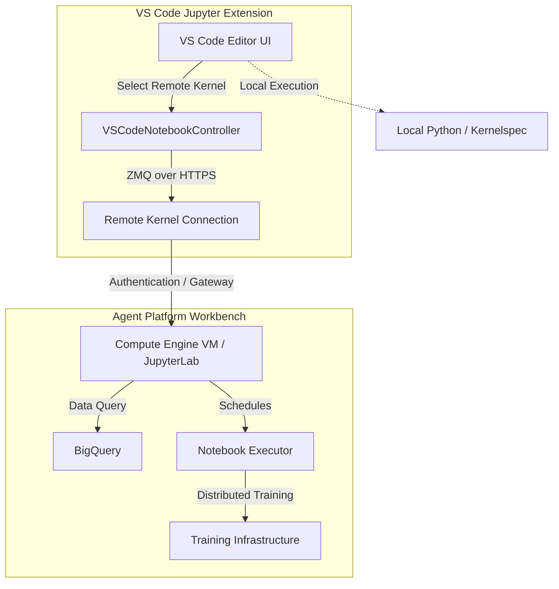

# Jupyter Notebook Environments: Local Client vs. Enterprise Cloud Platform

A comprehensive analysis combining the architectural study of the **VS Code Jupyter Extension** (local client) and the **Gemini Enterprise Agent Platform Workbench** (enterprise cloud platform).

---

## 1. Executive Summary

Modern AI and data science workflows rely on two complementary notebook execution paradigms:

1. **The Local Client (VS Code Jupyter Extension)**: Focuses on developer experience, editor integration, and ZMQ communication. It can orchestrate local kernels or act as a gateway to remote execution.
2. **The Cloud Platform (Agent Platform Workbench)**: Focuses on scalable compute, enterprise security, data warehouse integration, and headless execution.



---

## 2. Part 1: VS Code Jupyter Extension (Local Client)

The VS Code Jupyter extension is built on **InversifyJS-based Dependency Injection (IoC)** and integrates directly with VS Code's native Notebook APIs.

### A. Core Architecture & Discovery

* **IoC Container Bootstrapping**: On activation, [extension.node.ts](file:///c:/Users/thehb/Documents/RadLE%20v2/vscode-jupyter/src/extension.node.ts) initializes the container and registers services. The `IExtensionActivationManager` activates registered services on startup.
* **[KernelFinder](file:///c:/Users/thehb/Documents/RadLE%20v2/vscode-jupyter/src/kernels/kernelFinder.ts)**: Coordinates various `IContributedKernelFinder` services:
  * `LocalKernelSpec`: Locates non-Python kernelspecs (Julia, R, Scala) on the local filesystem.
  * `LocalPythonEnvironment`: Discovers local Python interpreters using the VS Code Python Extension API.
  * `Remote`: Connects to remote Jupyter servers and fetches active or available sessions.

### B. Controller Registration & Connection Restoration

* **[ControllerRegistration](file:///c:/Users/thehb/Documents/RadLE%20v2/vscode-jupyter/src/notebooks/controllers/controllerRegistration.ts)**: Dynamically registers `VSCodeNotebookController` instances (wrapping `vscode.NotebookController`) for both standard notebooks and the interactive window.
* **[VSCodeNotebookController](file:///c:/Users/thehb/Documents/RadLE%20v2/vscode-jupyter/src/notebooks/controllers/vscodeNotebookController.ts)**: Handles execution requests (`handleExecution`). It also supports **Connection Restoration**—if VS Code is reloaded during a long-running execution, it reconnects to the ZMQ session, identifies the running cell's message ID, and restores the progress UI.

### C. The Execution Pipeline

1. **`CellExecutionQueue`**: Queues notebook cells and executes them sequentially to prevent race conditions.
2. **`CellExecution`**: Triggers `@jupyterlab/services` `requestExecute` over ZMQ.
3. **`CellExecutionMessageHandler`**: Listens to the `iopubMessage` stream. It parses stdout/stderr streams (merging chunks for performance) and intercepts custom comm messages (such as IPyWidgets Output Widgets) to map their output back to their owner cells.

---

## 3. Part 2: Agent Platform Workbench (Cloud Platform)

The **Agent Platform Workbench** (formerly Vertex AI Workbench) is an enterprise JupyterLab-based development environment running on Google Compute Engine (GCE) VM instances.

### A. Core Features & Customization

* **Deep Learning Runtimes**: Pre-packaged with GPU/CPU-optimized environments containing TensorFlow, PyTorch, and common data science libraries.
* **Conda Environments**: Supports adding custom Conda environments (e.g., R, Apache Beam, or specific legacy framework versions) which automatically register as JupyterLab kernels.
* **Custom Containers**: Runtimes can be customized using container images, provided they are derived from the Google-provided base container (`gcr.io/deeplearning-platform-release/workbench-container:latest`).
* **Compute Engine Reservations**: Integrates with GCE reservations to guarantee VM resource availability (CPUs, GPUs, and SSDs).

### B. Cloud & Data Integration

* **Native Data Connectors**: JupyterLab navigation menus include built-in integrations:
  * *Cloud Storage*: Browse, read, and write files directly within Cloud Storage buckets.
  * *BigQuery*: Browse tables, write SQL queries, preview results, and load datasets directly into notebooks.
* **Managed Apache Spark (Dataproc)**: Allows executing notebook code directly on a Managed Service for Apache Spark cluster from within the JupyterLab UI.
* **Notebook Executor**: Runs `.ipynb` files headlessly as one-time or scheduled tasks.
  * Supports **parameterized execution** (e.g., changing learning rates or dataset paths per run).
  * Executes on Agent Platform custom training for distributed training and hyperparameter tuning.
  * Saves outputs to a Cloud Storage bucket for easy sharing and auditing.

### C. Enterprise Security, Networking, & Management

* **Identity and Access Control**: Access is governed by Google Cloud IAM.
  * *Workforce Identity Federation*: Supports third-party credentials (via workforce pool principals linked to external Identity Providers).
  * *Credentials*: Runs under a default Service Account or uses **End-User Credentials** to authenticate GCP API calls on behalf of the active user.
* **VPC & Networking**: Can be deployed within a private VPC network or behind a VPC Service Perimeter (VPC Service Controls) with public IP addresses disabled.
* **Customer-Managed Encryption Keys (CMEK)**: Disks (boot and data) can be encrypted using keys managed in Cloud KMS.
* **Confidential Computing**: Supports enabling Confidential VMs to encrypt data-in-use (protecting memory using hardware-based encryption).
* **Cost Optimization**: Includes an **Idle Shutdown** feature that automatically stops instances after a customizable period of inactivity.

### D. Platform Limitations

* Third-party JupyterLab extensions are not supported.
* Context-aware access controls (via Access Context Manager and Chrome Enterprise Premium) evaluate access on every user authentication session.
* Custom VM images or custom containers not derived from the official Google base image are unsupported due to potential service compatibility issues.

---

## 4. Comparative Synthesis

The following table contrasts the design focus and capabilities of both environments:

| Feature                      | VS Code Jupyter Extension (Local Client)          | Agent Platform Workbench (Cloud Platform)              |
| :--------------------------- | :------------------------------------------------ | :----------------------------------------------------- |
| **Execution Host**     | Local machine (or remote via ZMQ gateway)         | Dedicated Google Compute Engine (GCE) VM               |
| **UI Environment**     | VS Code Native Notebook Editor                    | JupyterLab (Web-based)                                 |
| **Compute Scaling**    | Bound to local hardware                           | Scalable VM machine types (CPU/GPU)                    |
| **Data Integration**   | Manual (via local credentials & client libraries) | Native UI integrations (BigQuery, Cloud Storage)       |
| **Automation**         | Client-dependent                                  | Native**Notebook Executor** (Scheduled/Headless) |
| **Network Security**   | Local machine network policies                    | VPC, Private Service Connect, Shared VPC               |
| **Encryption & Trust** | Local OS security policies                        | CMEK (Cloud KMS) and Confidential VMs                  |
| **Extensibility**      | VS Code Extensions                                | JupyterLab Extensions, custom Conda/Containers         |

---

## 5. Hybrid Remote Workflows & Integration Bridge

A key intersection between these two technologies is **Remote Jupyter Connections**. Using the VS Code Jupyter Extension, a developer can configure a remote connection to an **Agent Platform Workbench** instance.

The integration is implemented programmatically by the [colab-enterprise-vscode](https://github.com/GoogleCloudPlatform/colab-enterprise-vscode) extension, which bridges the local VS Code editor and the cloud-based Workbench environment.

```
[Local VS Code Client] 
       │
       ▼ (ZMQ over HTTPS / WebSockets)
[Agent Platform Workbench Gateway]
       │
       ▼ (VPC Internal)
[Jupyter Server (GCE VM)] <───> [BigQuery / Cloud Storage]
```

### A. How the Bridge Works

The `colab-enterprise-vscode` extension implements the `@vscode/jupyter-extension` API's server provider interfaces:

1. **`JupyterServerProvider`**: Exposes the `provideJupyterServers` and `resolveJupyterServer` methods.
2. **`JupyterServerCommandProvider`**: Declares a command `Connect to Workbench Instances` (`WORKBENCH_COMMAND`).

When the user selects the command:

* The extension prompts the user to select a Google Cloud project.
* It queries the Google Cloud Notebooks API (via `NotebooksClient.listInstances`) to fetch active Workbench instances.
* For the selected instance, it creates a `WorkbenchJupyterServer` containing the instance's **secure HTTPS proxy URI** (`proxyUri`).

### B. Kernel Discovery and Authentication

* **Token Enrichment**: When the VS Code Jupyter extension attempts to connect, `resolveJupyterServer` calls `WorkbenchInstanceManager.refreshConnection`. It fetches a fresh Google Cloud OAuth access token and attaches it as an `Authorization` header:
  ```typescript
  const headers = {
    'Authorization': `Bearer ${accessToken}`,
    'Cookie': '_xsrf=XSRF',
    'X-XSRFToken': 'XSRF',
    'Origin': `https://${server.proxyUri}`
  };
  ```
* **Kernel Delegation**: Once the connection is established, the VS Code Jupyter extension makes standard Jupyter REST and WebSocket calls directly to the Workbench instance's proxy URI:
  * `GET /api/kernelspecs` to discover all available kernels (including custom Conda environments and custom containers).
  * `POST /api/kernels` to launch a remote kernel session on the Workbench VM.
  * `/api/kernels/<kernel_id>/channels` via WebSockets to execute cells and handle interactive widgets.

This design delegates all kernel lifecycle and execution management to the VS Code Jupyter extension, using `colab-enterprise-vscode` purely as an authentication and discovery broker.

---

## 6. Case Study: Real-World Remote Workbench Deployment

To illustrate the concepts in this study, we analyze a live development environment deployed in a Google Cloud project.

### A. Instance Specifications: `medical-master-radfm`

This active Vertex AI Workbench instance represents a high-performance deep learning node:

* **Project**: `crashlab-synthetic`
* **Zone**: `northamerica-northeast2-b` (Montreal, Canada)
* **Resource ID**: `61a3c3a5-6790-4321-adb1-d61bce3ee1d5`
* **Proxy URL**: `769539ba7210760c-dot-northamerica-northeast2.notebooks.googleusercontent.com`
* **External IP**: `34.130.137.71`

#### Hardware Configuration:

* **Machine Type**: `g2-standard-24` (24 vCPUs, 96 GB RAM, Intel Cascade Lake)
* **GPUs**: **2x NVIDIA L4 GPUs** (accelerator type `NVIDIA_L4` with drivers pre-installed)
* **Storage**: 200 GB balanced boot disk (PD_BALANCED) and 100 GB standard data disk (PD_STANDARD), both secured via Google-Managed Encryption Keys (GMEK).

#### Software Stack:

* **Base Image**: `workbench-instances-2603` from the `cloud-notebooks-managed` project.
* **Framework**: PyTorch 2.1.
* **Frontend**: JupyterLab 4 enabled.

### B. Access Control and Permissions

Access to this instance for the developer account (`hbsb2566@gmail.com`) is governed by granular Google Cloud IAM roles. Connecting the local VS Code client via the `colab-enterprise-vscode` bridge requires the following active roles:

1. **`roles/notebooks.viewer` & `roles/notebooks.editor`**: Allows the client to discover the instance via `listInstances` and manage its state.
2. **`roles/iam.serviceAccountUser`**: Required to run operations under the instance's service account (`156953787469-compute@developer.gserviceaccount.com`).
3. **`roles/compute.admin` & `roles/compute.osAdminLogin`**: Enables the underlying Compute Engine VM operations and permits OS-level interaction/SSH access.
4. **`roles/aiplatform.user` & `roles/aiplatform.colabEnterpriseAdmin`**: Governs broader Vertex AI agent and notebook session execution.

### C. Empirical Runtime and GPU Analysis

Direct shell execution on the running `medical-master-radfm` instance reveals the following active hardware and container topology:

#### 1. GPU Status (`nvidia-smi`)

The instance runs on two active NVIDIA L4 GPUs:

* **Driver Version**: `580.65.06`
* **CUDA Version**: `13.0`
* **Memory**: `23034MiB` per GPU (totaling ~46GB VRAM)
* **Idle Power**: ~12W–13W per card (maximum capacity 72W)
* **Thermal**: 31°C–32°C

#### 2. Container Topology (`docker ps`)

The Workbench VM orchestrates the Jupyter environment using three core Docker containers running in the background:

* **`proxy-agent`** (`gcr.io/inverting-proxy/agent:latest`): The secure reverse-proxy agent that connects to the Google Front End (GFE), establishing the authenticated `proxyUri` tunnel.
* **`google-wi-idle-shutdown`** (`vertex/workbench-agent:local`): The idle-shutdown monitor daemon that tracks CPU/API inactivity and triggers instance suspension.
* **`notebooks-collection-agent`** (`us-docker.pkg.dev/deeplearning-platform/...`): The telemetry agent responsible for reporting VM status and health metrics (`system_health`, `docker_status`, `jupyterlab_status`) back to the Google Cloud control plane.

---

## 7. The Broader Ecosystem: Agent Platform & MCP Integration

The **Gemini Enterprise Agent Platform** (formerly Vertex AI) wraps these notebook environments into a unified, model-agnostic AI agent development and execution ecosystem.

```
                  ┌─────────────────────────────────┐
                  │    Gemini Enterprise Agent      │
                  │            Platform             │
                  └────────────────┬────────────────┘
                                   │
         ┌─────────────────────────┼─────────────────────────┐
         ▼                         ▼                         ▼
┌──────────────────┐     ┌──────────────────┐     ┌──────────────────┐
│  Workbench VM    │     │   Remote MCPs    │     │   Model Garden   │
│ (Custom Tools &  │     │ (GCA / Design    │     │ (Gemini, Claude, │
│  Kernel Host)    │     │  Center APIs)    │     │  etc. - Choice)  │
└──────────────────┘     └──────────────────┘     └──────────────────┘
```

### A. Core Integration Roles

* **The Workbench Role**: Vertex AI Workbench serves as the data science sandbox and custom container development environment. When developers need to build custom tools, train models, or write custom agent logic, they execute it in a Workbench instance (such as the `medical-master-radfm` GPU node).
* **Remote MCP Integration**: The **Gemini Cloud Assist MCP** and **Application Design Center MCP** are hosted remote endpoints (`https://geminicloudassist.googleapis.com/mcp`) running directly on this agent infrastructure. They allow external clients (like VS Code, Claude Desktop, or custom IDE agents) to securely invoke the platform's native agent capabilities—such as `design_infra` (infrastructure design) and `investigate_issue` (deep diagnostics)—using Google Cloud credentials.
* **Model Choice**: The platform is model-agnostic, supporting Google's multimodal Gemini models alongside third-party options (such as the Anthropic Claude model family). This allows agents running on the platform to be routed to the best-suited model for a specific task.

### B. Connecting and Authenticating to the Remote MCP

To connect an MCP client (such as this IDE agent or the Gemini CLI) to the Gemini Cloud Assist remote endpoints, the following configurations and credentials must be established:

#### 1. Client Configuration (JSON)

For the local agent/IDE to communicate with the remote GCP services, the remote server URLs must be defined in the client's MCP configuration block:

```json
"mcpServers": {
  "gemini_cloud_assist": {
    "serverUrl": "https://geminicloudassist.googleapis.com/mcp",
    "headers": {},
    "authProviderType": "google_credentials"
  },
  "application_design_center": {
    "serverUrl": "https://designcenter.googleapis.com/mcp",
    "headers": {},
    "authProviderType": "google_credentials"
  }
}
```

#### 2. Authentication (IDE Integrated Provider)

When using an MCP-compatible IDE (like Antigravity or Cursor), manual Application Default Credentials (ADC) setup via the gcloud CLI is not required.

By using the `"authProviderType": "google_credentials"` option, the IDE automatically intercepts the MCP server's requests and attaches the OAuth access token from the active user's IDE login session. This bypasses local browser OAuth blocks (`invalid_client` errors) entirely, allowing secure, zero-config access.

#### 3. Required IAM Roles

For the active user credentials to successfully execute tools via the remote MCP server, the authenticated user identity must have the following IAM roles in the target Google Cloud project:

* **`roles/mcp.toolUser` (MCP Tool User)**: Explicitly permits the user identity to execute remote MCP tools.
* **`roles/geminicloudassist.user` (Gemini Cloud Assist User)**: Grants permission to invoke the underlying Gemini Cloud Assist agent reasoning and tools.
* **`roles/aiplatform.user` (Vertex AI User)**: Required for accessing Vertex AI resources and executing agent models.

---

## 8. Advanced Integration Challenges & Best Practices

When operating a local IDE client (like Antigravity) against a high-performance remote Workbench instance, developers must address several proxy, credential, and hardware lifecycle behaviors:

### A. Web Proxy & WebSocket Header Constraints

Because the Workbench `proxyUri` is behind an authenticated Google Front End (GFE) rather than serving as a transparent network tunnel:

* **WebSocket Protocol (`wss://`)**: The IDE's network layer must convert connection URIs to the secure WebSocket protocol (`wss://`) when talking to the remote kernel channels.
* **Strict Origin Header Validation**: The GFE proxy strictly validates the `Origin` header of incoming WebSockets. If the `Origin` header does not match the `proxyUri` exactly, the connection fails with a `403 Forbidden` error, regardless of token validity:
  ```typescript
  // Required header injection during ZMQ WebSocket connection
  {
    'Origin': `https://${server.proxyUri}`
  }
  ```

### B. Remote Credential Bridging

Notebook cells executing on the remote VM do not run under your local IDE credentials by default:

* **Default Context**: Shell commands and client library calls (e.g., `google.cloud.bigquery.Client()`) execute using the VM's assigned Compute Engine Service Account.
* **End-User Credentials (EUC)**: If the notebook needs to act as the active developer (e.g., to enforce personal BigQuery dataset access policies), the Workbench instance must be created with **End-User Credentials** enabled. Alternatively, the developer must run the interactive `!gcloud auth login` command inside a notebook cell once per kernel session.

### C. Port Forwarding and Web UIs (The "Localhost" Trap)

For services running inside the notebook that expose local web interfaces (e.g., TensorBoard on port `6006` or Streamlit on `8501`):

* **URL Mapping**: The standard `localhost:[port]` address is inaccessible. Instead, Vertex AI Workbench provides a built-in reverse proxy.
* **Proxy Pattern**: Local ports are dynamically mapped to a public, authenticated URL matching the pattern:
  `https://[port]-dot-[proxyUri]`
* **IDE Support**: The IDE client should automatically detect active ports on the remote VM and surface these proxy links in the status bar for easy access.

### D. GPU Lifecycle & Resiliency (NVIDIA L4)

With high-performance nodes like the `medical-master-radfm` (utilizing dual NVIDIA L4 GPUs):

* **GPU Monitoring**: Since standard Jupyter interfaces do not track GPU utilization, the IDE can query `nvidia-smi` metrics via a background shell command or the MCP `investigate_issue` tool to display a real-time GPU load meter in the editor status bar.
* **Compute Engine Live Migration**: During GCE hardware maintenance, the VM may undergo Live Migration. While the VM remains active, this transition can cause a transient driver reset or "hiccup" in the GPU kernel. The IDE's **Connection Restoration** logic must be resilient enough to automatically reconnect and restore the running cell's state after a transient GPU reset.

### E. Idle Shutdown vs. State Persistence (Heartbeat Blocking)

Vertex AI Workbench instances are configured with an **Idle Shutdown** feature to save costs. However, a local IDE connection can inadvertently block this:

* **The Conflict**: If the local IDE maintains an active ZMQ heartbeat connection to monitor the remote kernel's health or query status, the Jupyter server registers this as activity. This resets the idle timer on the VM, preventing it from ever shutting down and resulting in unexpected billing.
* **Best Practice**: The IDE client should implement a **"Smart Sleep"** mode. If the IDE window loses focus or there is no user activity for a configurable period (e.g., 15 minutes), the client should pause ZMQ heartbeat polling, allowing the VM's native idle-timeout policy to execute.

### F. VPC Service Controls (VPC-SC) & Access Context Manager

In highly secure enterprise Google Cloud Organizations:

* **The Perimeter**: If the target project is placed within a **VPC Service Perimeter**, all access to the `proxyUri` will be blocked from external networks by default.
* **Access Context Manager**: To bypass this perimeter, the IDE must route traffic from a trusted IP range, or send specific device posture signals (e.g., via integration with Chrome Enterprise Premium) to satisfy the ingress policies defined in the Access Context Manager.

### G. Lifecycle Hooks for Extension Development

When developing or extending the VS Code Jupyter integration (e.g., modifying `vscode-jupyter` source code), the following entry points are critical for Workbench customization:

* **`IJupyterServerUriStorage`**: The interface defined in [types.ts](file:///c:/Users/thehb/Documents/RadLE%20v2/vscode-jupyter/src/kernels/jupyter/types.ts#L148) (implemented by `JupyterServerUriStorage` in [serverUriStorage.ts](file:///c:/Users/thehb/Documents/RadLE%20v2/vscode-jupyter/src/kernels/jupyter/connection/serverUriStorage.ts#L37)) that stores remote Jupyter server URIs. To protect enterprise infrastructure details, any extension implementation should ensure this storage is encrypted, preventing the leakage of internal `proxyUri` strings.
* **Kernel Selection QuickPick**: When displaying remote kernels in the VS Code quick pick, extensions can hook into the selection provider (such as the provider registry) to inject custom GCP branding or display live status indicators (e.g., "Starting", "Provisioning", "Active") next to the remote instance names.

---

## 9. Future Roadmap & IDE Enhancements

To deliver a premium, integrated experience for Google Cloud developers, the local IDE (Antigravity) can implement the following advanced capabilities:

### A. GCE Metadata "Config-Drive" Scaffolding

Vertex AI Workbench instances use GCE Metadata as their primary configuration store:

* **Configuration Auditing**: Antigravity can read GCE instance metadata via `gcloud compute instances describe` to parse the `proxy-mode` and `proxy-url` keys. A `proxy-mode: service_account` verifies that the instance is using the secure v2 architecture.
* **Environment Scaffolder**: Prior to instance booting, Antigravity can write custom setup configurations directly to the `startup-script` metadata key (e.g., pre-installing utilities like `htop` or custom monitoring tools). This ensures consistent environments across a team without manual intervention.

### B. Cloud Storage FUSE Performance Warnings

Many data scientists mount Cloud Storage buckets directly to their VMs using GCSfuse:

* **The Performance Trap**: While FUSE mounts (typically located under the `/gcs/` path) are convenient, they suffer from high latency during small-file operations and do not support random writes. This can cause severe performance bottlenecks during model training.
* **IDE Guidance**: If Antigravity detects that a notebook or script is actively reading/writing paths starting with `/gcs/`, it should display a non-intrusive warning: *"Warning: Operating directly on Cloud Storage via FUSE. For high performance, copy data to the local VM SSD (`/home/jupyter/`) first."*
* **GCS Explorer**: An integrated GCS bucket explorer in the sidebar can allow developers to browse buckets and trigger background `gsutil cp` transfers directly to the VM's local SSD.

### C. Pre-Flight Quota & Health Verification

* **Pre-Flight Check**: Before attempting to boot or connect to a remote VM, the IDE can query `consumerQuotaMetrics` for GPU resources (e.g., `NVIDIA_L4_GPUS`) in the target region.
* **Granular Feedback**: If a quota is exceeded or the VM is stuck in a `PROVISIONING` or `STAGING` state, the IDE should surface specific, actionable error messages (e.g., *"Cannot start instance: Project has reached its L4 GPU quota in northamerica-northeast2."*) rather than a generic connection failure.

### D. Vertex AI Experiments Integration

For machine learning workflows tracking parameters and metrics:

* **Metadata Injection**: The IDE can automatically inject the active Vertex AI Experiment ID into the notebook's environment variables.
* **Real-Time Dashboard**: When the editor detects a cell executing `aiplatform.init(experiment='...')`, it can open a dedicated side-panel displaying real-time metrics, parameter tables, and training curves directly from the Vertex AI Experiments console.

